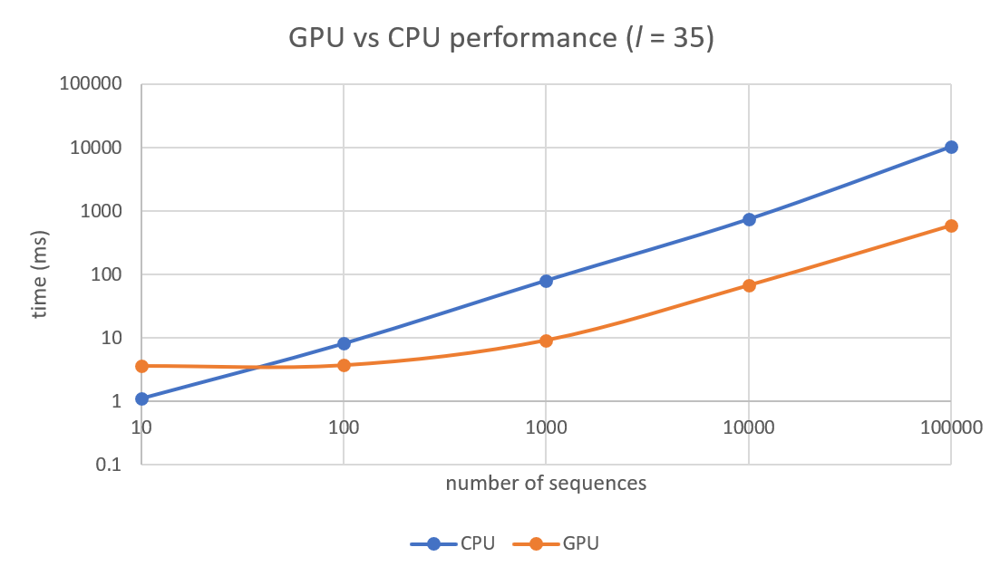

# Hamming one
The program provides a solution for the Hamming one problem in linear time using a static GPU hash table.
## Problem statement
Given a set of bit sequences, find all pairs with the Hamming distance equal to 1.
The Hamming distance (denoted `d`) between two binary strings of equal length is defined as the number of positions at which the corresponding bits are different. 
For example, `d(0000, 1111) = 4` and `d(10011, 11011) = 1`.
## Solution
### The naive way
An obvious approach would be to calculate the Hamming distance for each pair of sequences.
The time complexity of this solution would be `O(l * n^2)`. 
A more optimal approach relies on a hash map.
### A better approach
We can assign each position in a sequence two hash objects: _own_ and _matching hash_.
These objects have the following property: if a sequence `a` has matching hash `h1`, and the own hash of sequence `b` is equal to `h1`, then `d(a, b) = 1`.
More specifically, the aforementioned hash object, for a position k of sequence s, is a triple containing
* two hashes: one calculated from the subsequence `s[0..k-1]` - _prefix hash_, and the other from `s[k+1..|s|-1]` - _suffix hash_,
* an integer that is either 
  1. the bit `s[i]` or 
  2. the bit that is the negation of `s[i]`.

    The hash objects given by 1. are called _own hashes_ whereas the objects given by 2. are referred to as _matching hashes_.

At this point, we have to find an efficient way of calculating prefix and suffix hashes.
Notice that calculating the suffix/prefix hashes separately for each subsequence of a given sequence takes `O(l^2)` operations.
This is simply because hashing a sequence of length `l` has to take `O(l)` time.
Hence the time complexity of this approach would be `O(l^2 * n)`.
### A yet better approach
We can do better by calculating the suffix/prefix hashes in an incremental manner using a [rolling hash](https://en.wikipedia.org/wiki/Rolling_hash) (sometimes also called a _polynomial hash_).
This way, for a sequence of length `l`, all prefix and suffix hashes can be computed in `O(l)` time. This means that the whole algorithm will run in `O(n * l)`. 
Obviously, there is no guarantee that the function used for calculating prefix and suffix hashes won't yield the same result for different sequences.
Assuming we're computing a polynomial hash modulo `m`, we can minimize the chances of such an event occurring by setting `m` to be as big as possible, as the probability that a collision happens is (roughly) proportional to `1 / m`.
Moreover, by computing suffix hash modulo `m1` and prefix hash modulo `m2`, the probability of collision can be further reduced to `(1 / m1 * m2)` provided that `m1` and `m2` coprime; cf. [double polynomial hash](https://codeforces.com/blog/entry/60445) for details. 
### Details
There is an important caveat that concerns GPU implementation.
In case of duplicate input sequences, a find operation on a given hash object would return an unknown-in-advance number of results.
This is problematic because there is no way to know how much memory to allocate to store the results.
Thus before executing the algorithm described above we eliminate the duplicates and store the information about deleted sequences so that after obtaining the hamming one pairs we can "extend" the result set to include all sequences. 
To make the comparison between CPU and GPU implementations fair, the same sort of pre- and post-processing will be applied in both cases.
## Results
The algorithm has been implemented on the CPU (using `std::unordered_map`) and GPU (using a custom-made GPU hash table `HashTableSC`).
The comparison of the performance of both implementations is shown in the graph below.

On average, the GPU implemntation was 10 times faster compared to the CPU implementation.

## Acknowledgments
Portions of the source code are based on
* the paper _Better GPU Hash Tables_ by Muhammad A. Awad, Saman Ashkiani, Serban D. Porumbescu, Martín Farach-Colton, and John D. Owens,
*  the project: [BGHT: Better GPU Hash Tables](https://github.com/owensgroup/BGHT) (licensed under Apache 2.0 license) by the same authors.

All relevant files have been marked with the original copyright notice.